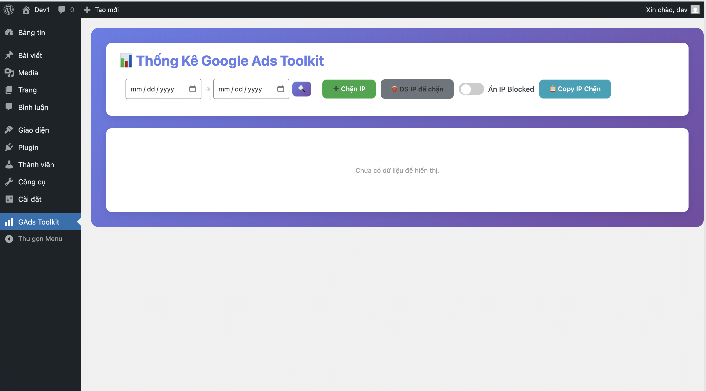

# 🛡️ GAds Toolkit - Chống Click Ảo Toàn Diện cho Google Ads

**GAds Toolkit** là giải pháp WordPress chuyên nghiệp giúp theo dõi, phân tích và tự động chặn các hành vi click ảo, click tặc từ quảng cáo Google Ads. Hệ thống sử dụng công nghệ chặn Real-time kết hợp với Google Ads API để bảo vệ ngân sách quảng cáo của bạn 24/7.

## ✨ Tính năng nổi bật

- **🔍 Theo dõi Real-time:** Ghi lại mọi lượt truy cập kèm theo `gclid`, thông tin thiết bị và hành vi.
- **⚡ Chặn IP Tức thì (Real-time Block):** Tự động chặn IP ngay khi phát hiện vi phạm quy tắc (số click/thời gian) mà không cần chờ đợi.
- **🔗 Đồng bộ Google Ads API:** Tự động đẩy IP bị chặn vào danh sách loại trừ (IP Exclusions) của tài khoản Google Ads.
- **📱 Smart Cross-IP Blocking:** Sử dụng công nghệ Cookie Tagging để nhận diện và chặn kẻ tấn công ngay cả khi họ đổi từ IPv4 sang IPv6 hoặc ngược lại.
- **🌐 Hỗ trợ Dual-Stack:** Hỗ trợ đầy đủ cả IPv4 và IPv6.
- **📊 Dashboard Thông Minh:** Xem báo cáo theo ngày (7, 15, 30, 60, 180 ngày hoặc Hôm nay) với biểu đồ trực quan.
- **🗂️ Quản Lý IP Nâng Cao:** Lọc IP bị chặn theo ngày, số phiên, copy danh sách dễ dàng.
- **🔔 Thông báo đa kênh:** Cảnh báo ngay lập tức qua Telegram và Email kèm báo cáo traffic hàng ngày.
- **🚀 Tối ưu hiệu suất:** Cơ chế Cron-job server-side đảm bảo hệ thống hoạt động ổn định ngay cả khi website không có người truy cập.

## 🛠️ Yêu cầu hệ thống

- **WordPress:** 5.0 trở lên.
- **PHP:** 7.4 hoặc 8.x (Có cài đặt module cURL).
- **Server:** Khuyến nghị Linux (Ubuntu 20/22) có hỗ trợ IPv6.
- **Google Ads API:** Yêu cầu Developer Token và quyền truy cập API.

## 📥 Cài đặt nhanh

1. Copy thư mục `gads-toolkit` vào thư mục `/wp-content/plugins/`.
2. Truy cập WordPress Admin -> Plugins -> **Activate**.
3. Cấu hình các thông số cơ bản tại menu **GAds Toolkit**.

## 📖 Tài liệu hướng dẫn

Để hệ thống hoạt động hiệu quả nhất, vui lòng tham khảo các tài liệu sau:

- [Hướng dẫn cấu hình chi tiết (SETUP-GUIDE.md)](./help/SETUP-GUIDE.md): Cấu hình API, Server Cron và Notifications.
- [Chiến lược chặn IP (IP-DOCS-README.md)](./help/IP-DOCS-README.md): Tài liệu về IPv4/IPv6 và Cloudflare.

---

© 2026 GAds Toolkit - Designed for Advanced Ad Protection.
