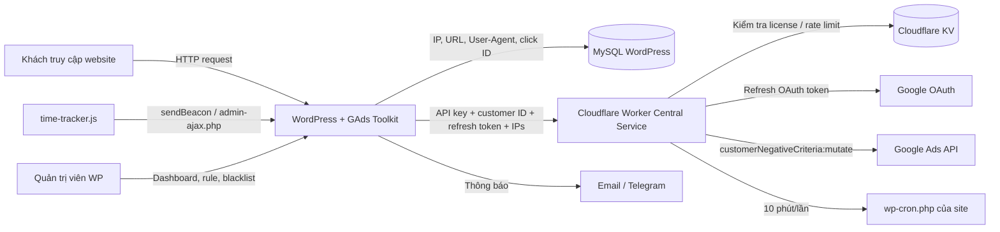
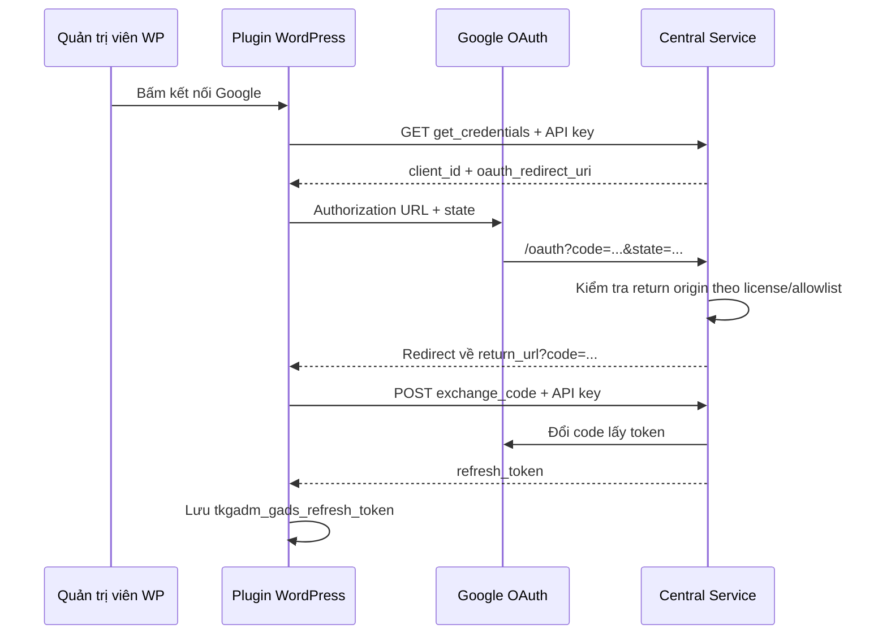

# GAds Toolkit — Tài liệu vận hành và kỹ thuật

> Tài liệu này mô tả **mã nguồn đang có trong working tree ngày 05/09/2026**, phiên bản `4.1.9`, trên nhánh `release/v3.7.5`. Working tree có thay đổi chưa commit, vì vậy đây là mô tả của trạng thái file thực tế tại thời điểm rà soát, không chỉ của commit gần nhất.

## 1. Tài liệu này dành cho ai?

Tài liệu phục vụ hai nhóm người đọc:

- **Quản trị viên WordPress/Google Ads:** cần hiểu phần mềm thu thập gì, số liệu có nghĩa gì, khi nào IP bị đưa vào danh sách chặn, cách đồng bộ và cách xử lý sự cố.
- **Người vận hành kỹ thuật/lập trình viên:** cần hiểu cấu trúc mã nguồn, WordPress hooks, AJAX, cron, database, OAuth, Cloudflare Worker, KV, license và quy trình phát hành.

Tài liệu mô tả hành vi thực tế từ mã nguồn. Các tuyên bố marketing như mức tiết kiệm ngân sách, GDPR/CCPA hoặc hiệu quả chống click ảo không được xem là kết quả đã được kiểm chứng kỹ thuật.

---

## 2. Hiểu hệ thống trong một phút

GAds Toolkit gồm hai hệ thống chạy độc lập nhưng phối hợp với nhau:

1. **Plugin WordPress tại website khách hàng**
   - Ghi nhận IP, URL, User-Agent, `gclid`/`gbraid`, thời gian ở trang.
   - Tổng hợp dữ liệu thành Dashboard.
   - Cho phép quản trị viên thêm/bỏ IP trong blacklist nội bộ.
   - Tự động phát hiện IP vượt ngưỡng đã cấu hình.
   - Gửi Email/Telegram.
   - Gửi danh sách IP sang Central Service để tạo IP exclusion trong Google Ads.

2. **Central Service tại `https://gads.pdl.vn`**
   - Chạy bằng Cloudflare Worker.
   - Xác thực API/license key của từng website.
   - Giữ Google OAuth Client Secret và Google Ads Developer Token ở Worker Secrets.
   - Đổi OAuth authorization code/refresh token thành access token.
   - Gọi Google Ads API để tạo `customerNegativeCriteria` loại `ip_block`.
   - Quản lý license, client site, cấu hình và log trong Cloudflare KV.
   - Ping `wp-cron.php` của site đã đăng ký mỗi 10 phút.



### Điều quan trọng nhất về chữ “chặn”

Trong mã hiện tại, “chặn IP” có hai ý nghĩa:

- thêm IP vào bảng blacklist nội bộ `wp_gads_toolkit_blocked`;
- nếu đồng bộ thành công, thêm IP vào danh sách loại trừ cấp tài khoản Google Ads.

**Plugin không có hook trả HTTP 403, không redirect và không dừng việc xem website của IP trong blacklist.** Vì vậy cụm “chặn ở website” trong một số thông báo giao diện thực chất chỉ có nghĩa là “đã lưu vào blacklist nội bộ”, không phải firewall chặn truy cập website.

---

## 3. Cấu trúc dự án

```text
gads-toolkit/
├── gads-toolkit.php                 # Bootstrap plugin, version, service URL
├── includes/
│   ├── core-engine.php              # DB, tracking, IP rules, auto-block, menu/assets
│   ├── module-dashboard.php         # Dashboard WP và các AJAX thống kê/chặn IP
│   ├── module-data.php              # Quản lý blacklist và xóa logs
│   ├── module-google-ads.php        # Central Service, OAuth, Google Ads sync, cron sync
│   ├── module-notifications.php     # Email, Telegram, cảnh báo, báo cáo, test kết nối
│   └── module-settings.php          # Trang Cấu hình & Tích hợp đang được dùng
├── assets/
│   ├── admin-script.js              # Tương tác Dashboard, chart, modal, pagination
│   ├── admin-style.css              # CSS quản trị
│   ├── chart.umd.min.js             # Chart.js đóng gói cục bộ
│   └── time-tracker.js              # Đo thời gian ở trang phía trình duyệt
├── cloudflare-worker/
│   ├── src/
│   │   ├── index.js                 # Router Worker
│   │   ├── api.js                   # API dành cho plugin WordPress
│   │   ├── auth.js                  # API key, admin password, rate limit
│   │   ├── oauth.js                 # OAuth redirect relay
│   │   ├── admin.js                 # Admin UI + Admin API của Central Service
│   │   ├── cron.js                  # Ping wp-cron của các site khách
│   │   ├── utils.js                 # Response, log, validate/normalize dữ liệu
│   │   └── version.js               # APP_VERSION dùng chung khi release
│   ├── scripts/
│   │   ├── check-version.mjs        # Kiểm tra version Worker/package/plugin
│   │   └── build-landing.mjs        # Build landing page vào public/index.html
│   ├── public/                      # Static assets được Wrangler deploy
│   ├── package.json                 # npm scripts và version Worker
│   └── wrangler.toml                # Route, KV, cron, assets, non-secret vars
├── landing-page/                    # Nguồn landing page và prototype admin
├── prototype/                       # Prototype giao diện WordPress Admin
├── build-plugin-zip.command         # Đóng gói ZIP giao cho site khách
├── README.md                        # Nội dung giới thiệu/sales
└── CHANGELOG.md                     # Lịch sử phiên bản
```

### Những file chạy trong production

- Website khách cần phần plugin WordPress ở thư mục gốc, `includes/` và `assets/`.
- `cloudflare-worker/`, `landing-page/` và `prototype/` là mã vận hành/phát triển phía Central Service, không cần nằm trong ZIP plugin giao khách.
- Script đóng gói hiện loại toàn bộ `cloudflare-worker/`, các file backup, ZIP cũ, `.git`, `.wrangler`, `*.command` và một số thư mục phát triển.

---

## 4. Vòng đời plugin WordPress

### 4.1 Bootstrap

`gads-toolkit.php` thực hiện các việc sau:

1. Dừng ngay nếu file bị truy cập ngoài WordPress (`ABSPATH` chưa được định nghĩa).
2. Khai báo:
   - `GADS_TOOLKIT_VERSION = 4.1.9`;
   - đường dẫn và URL của plugin;
   - `GADS_SERVICE_URL = https://gads.pdl.vn`.
3. Luôn nạp `core-engine.php`, `module-google-ads.php`, `module-notifications.php`.
4. Chỉ khi `is_admin()` mới nạp Dashboard, Settings và Data module.

Điều này có nghĩa tracking, cron, sync và notification có thể chạy ở request frontend/cron; giao diện và phần lớn AJAX quản trị chỉ được đăng ký trong admin context.

### 4.2 Khi activate

Plugin:

- tạo hoặc nâng cấp hai bảng database;
- bổ sung các index còn thiếu;
- xóa rồi lên lịch lại cron cảnh báo IP và báo cáo ngày.

### 4.3 Khi truy cập WordPress Admin

Hook `admin_init` so sánh option `tkgadm_version` với version hiện tại và kiểm tra bốn index của bảng thống kê. Nếu version lệch hoặc thiếu index, plugin chạy `dbDelta()` và sửa index theo kiểu idempotent.

### 4.4 Khi deactivate

Plugin chỉ xóa lịch:

- `tkgadm_hourly_alert`;
- `tkgadm_daily_report`.

Hiện tại hook deactivate **không xóa** `tkgadm_hourly_sync_event` và `tkgadm_auto_block_scan_event`. Dữ liệu MySQL và các `wp_options` cũng được giữ lại; plugin không có uninstall routine.

---

## 5. Luồng ghi nhận một lượt truy cập

### 5.1 Xác định IP

Thứ tự ưu tiên trong `tkgadm_get_real_user_ip()`:

1. `CF-Connecting-IP`;
2. IP đầu tiên trong `X-Forwarded-For`;
3. `X-Real-IP`;
4. `REMOTE_ADDR`.

Mỗi giá trị phải qua `FILTER_VALIDATE_IP`, trừ fallback `REMOTE_ADDR` chỉ được sanitize. Khi website không đứng sau proxy đáng tin cậy, `X-Forwarded-For` có thể bị client giả mạo; cấu hình máy chủ/proxy phải loại hoặc ghi đè header không đáng tin.

### 5.2 Nhận diện Ads và Organic

Hook `wp_head` chạy `tkgadm_track_visit()` trên frontend:

- `gclid` được ưu tiên;
- nếu không có `gclid`, plugin dùng `gbraid` và lưu chung vào cột `gclid`;
- URL chứa `gad_source` được coi là dấu hiệu Ads cho bước lọc bot, nhưng **auto-block tức thì chỉ chạy khi thực sự có `gclid` hoặc `gbraid`**;
- traffic không có click ID và không có `gad_source` được xem là Organic.

Đối với Organic, plugin loại một danh sách User-Agent đơn giản chứa các chuỗi như `bot`, `crawl`, `spider`, `curl`, `wget`, `python`… Đây không phải hệ thống bot detection hoàn chỉnh và có thể bị giả User-Agent.

### 5.3 Gộp record trong 30 phút

Khóa logic để tìm “cùng phiên” gồm:

- cùng IP;
- cùng URL đầy đủ;
- cùng User-Agent;
- cùng `gclid`/`gbraid`;
- record gần nhất không quá 30 phút.

Nếu tìm thấy, plugin tăng `visit_count` và đưa `visit_time` lên thời điểm mới nhất. Nếu không, plugin tạo record mới với `visit_count = 1`, `time_on_page = 0`.

Vì vậy một dòng database **không luôn bằng một lượt truy cập**. Một dòng có thể đại diện nhiều lần tải lại trong cùng nhóm 30 phút.

### 5.4 Đo thời gian ở trang

`assets/time-tracker.js` chạy cho traffic không bị bộ lọc bot PHP loại bỏ. Khi tab bị ẩn hoặc người dùng rời trang, script:

- tính số giây kể từ lúc load;
- bỏ qua nếu dưới 3 giây;
- gửi `ip`, URL, User-Agent, click ID và số giây đến `admin-ajax.php`;
- ưu tiên `navigator.sendBeacon`, fallback sang synchronous XHR.

Server tìm record mới nhất khớp chính xác IP + URL + User-Agent + click ID và cập nhật `time_on_page = max(giá trị cũ, giá trị mới)`.

Endpoint này cho phép cả khách chưa đăng nhập (`wp_ajax_nopriv`) và hiện **không có nonce/chữ ký**. Dữ liệu POST do trình duyệt cung cấp có thể bị giả mạo; đây là dữ liệu phân tích tham khảo, không nên xem là bằng chứng chống gian lận tuyệt đối.

---

## 6. Mô hình dữ liệu WordPress

Tên bảng thực tế dùng prefix WordPress; dưới đây giả sử prefix là `wp_`.

### 6.1 `wp_gads_toolkit_stats`

| Cột | Ý nghĩa |
|---|---|
| `id` | Khóa chính tự tăng |
| `ip_address` | IP được nhận diện tại request |
| `visit_time` | Thời điểm mới nhất của record/nhóm 30 phút |
| `url_visited` | URL đầy đủ, có query string |
| `user_agent` | User-Agent của trình duyệt |
| `gclid` | `gclid`, hoặc `gbraid`, hoặc chuỗi rỗng |
| `time_on_page` | Số giây lớn nhất client gửi về |
| `visit_count` | Số lần request được gộp vào record |

Index bắt buộc: `ip_address`, `visit_time`, `gclid`, `time_on_page`.

### 6.2 `wp_gads_toolkit_blocked`

| Cột | Ý nghĩa |
|---|---|
| `id` | Khóa chính tự tăng |
| `ip_address` | IP hoặc pattern; unique |
| `blocked_time` | Thời điểm thêm vào blacklist |
| `reason` | Lý do thủ công/tự động/Cross-IP |
| `visit_count` | Snapshot tổng visit tại thời điểm chặn |

Màn hình Quản lý dữ liệu tính lại visit count bằng `LEFT JOIN` với bảng stats. Nếu có dữ liệu sống, số mới này được ưu tiên hơn snapshot.

### 6.3 Dữ liệu nhạy cảm

Plugin lưu IP, User-Agent và URL đầy đủ. Query string có thể chứa `gclid`, UTM hoặc dữ liệu do ứng dụng khác đưa vào URL. Không có cơ chế retention tự động; quản trị viên phải chủ động xóa logs theo chính sách riêng tư của website.

---

## 7. Hiểu đúng các số liệu trên Dashboard

| Nhãn/khái niệm | Cách mã hiện tại tính |
|---|---|
| Record | Một dòng trong bảng stats; có thể gộp nhiều lượt trong 30 phút |
| Tổng lượt của một IP | `SUM(visit_count)` |
| Click Ads trong bảng IP | `COUNT(DISTINCT gclid)` theo IP |
| Ads của một ngày trên chart | `COUNT(DISTINCT ip_address)` có click ID trong ngày |
| Organic của một ngày trên chart | IP có `time_on_page > 0` và không có bất kỳ record Ads nào trong toàn bộ lịch sử |
| IP bị chặn của một ngày | Số row blacklist có `blocked_time` trong ngày |
| Tổng người Ads | Tổng các unique IP theo từng ngày; một IP xuất hiện nhiều ngày được cộng nhiều lần |
| Tổng Organic | Tổng các unique Organic IP theo từng ngày |
| TB người/ngày | Tổng “Ads theo ngày” chia số ngày trong khoảng |
| Tỷ lệ chặn | Tổng row bị chặn trong khoảng / tổng unique Ads IP theo ngày × 100 |

Các hệ quả cần nhớ:

- “Tổng người Ads” không phải số người thật và cũng không phải unique IP toàn khoảng thời gian.
- “Tỷ lệ chặn” không phải tỷ lệ click Ads bị chặn như dòng mô tả trên UI; mẫu số đang là tổng unique Ads IP theo ngày.
- Ba dòng xu hướng `+12%`, `+5%`, `+24%` dưới summary card là **nội dung tĩnh**, không có truy vấn kỳ trước.
- Dashboard chính chỉ liệt kê IP có `gclid`/`gbraid`; nút “Chỉ IP chặn” mới truy vấn toàn bộ blacklist, kể cả IP không có stats.
- Phân trang Dashboard là phía trình duyệt, 10 dòng/trang; query PHP vẫn tải toàn bộ IP trong khoảng ngày.
- Trang Quản lý dữ liệu giới hạn kết quả blacklist ở 1.000 IP.
- Match giữa blacklist và stats dùng so sánh IP chính xác. Pattern wildcard như `192.168.1.*` không join được với các IP cụ thể để tính visit count hoặc trạng thái từng dòng.

---

## 8. Các con đường đưa IP vào blacklist

### 8.1 Chặn thủ công

Quản trị viên có thể:

- gạt công tắc ở từng IP trên Dashboard;
- nhập nhiều IP trong modal, phân tách bằng dòng mới, dấu phẩy hoặc khoảng trắng;
- bỏ chặn từ Dashboard hoặc trang Quản lý dữ liệu.

AJAX kiểm tra nonce, quyền `manage_options` và định dạng IP. Khi chặn mới, plugin lưu snapshot tổng `visit_count`. Nếu `tkgadm_auto_sync_on_block` bật, plugin gửi IP đó lên Google Ads ngay.

### 8.2 Auto-block tức thì

Chạy ngay trong request frontend khi:

- request có `gclid` hoặc `gbraid`;
- `tkgadm_auto_block_enabled` bật;
- có ít nhất một rule.

Với mỗi rule, plugin đếm `COUNT(DISTINCT gclid)` của IP trong khoảng thời gian rule. Khi đạt ngưỡng:

1. thêm IP vào blacklist nếu chưa có;
2. đặt cookie `tkgadm_banned=1` trong 30 ngày;
3. gọi sync Google Ads ngay;
4. gửi thông báo Email/Telegram theo option kênh;
5. dừng ở rule đầu tiên gây chặn.

### 8.3 Auto-block theo cron 15 phút

Khi có rule, trang Settings tạo `tkgadm_auto_block_scan_event` mỗi 15 phút. Mỗi rule query tất cả IP có click ID trong cửa sổ thời gian và thêm IP mới vào blacklist. Sau đó plugin sync một batch và gửi một thông báo tổng hợp.

### 8.4 Smart Cross-IP

Nếu trình duyệt mang cookie `tkgadm_banned=1` nhưng đang dùng IP mới chưa có trong blacklist, request tiếp theo sẽ:

- thêm IP mới với lý do Cross-IP;
- sync Google Ads;
- gửi thông báo.

Giới hạn thực tế:

- cookie chỉ được đặt khi **auto-block tức thì** thành công, không được đặt khi chặn thủ công hoặc cron batch;
- xóa cookie/chế độ ẩn danh/trình duyệt khác sẽ không mang dấu Cross-IP;
- cookie hiện không khai báo `Secure`, `HttpOnly` hoặc `SameSite`;
- Cross-IP và auto-block tự động gọi sync trực tiếp, không kiểm tra công tắc “Đồng bộ ngay khi chặn”. Công tắc đó chỉ được tôn trọng trong handler chặn thủ công;
- auto-block tức thì gọi HTTP sync ngay trong hook `wp_head` với timeout tối đa 60 giây, nên lỗi/chậm ở dịch vụ ngoài có thể làm chậm render frontend;
- cookie được đặt từ `wp_head`; tùy theme/output buffering, response có thể đã gửi header và `setcookie()` không còn hiệu lực.

### 8.5 Khác biệt giữa hai engine auto-block

Hai đường kiểm tra không dùng cùng một đơn vị:

- tức thì dùng `COUNT(DISTINCT gclid)`;
- cron 15 phút dùng `COUNT(*)` số record, không dùng `visit_count` và không distinct click ID.

Do record bị gộp theo URL/User-Agent/click ID trong 30 phút, cùng một rule có thể cho kết quả khác nhau giữa kiểm tra tức thì và cron. Quản trị viên nên hiểu rule hiện không có một định nghĩa “click” duy nhất.

---

## 9. Định dạng IP và ý nghĩa đồng bộ

Plugin chấp nhận:

- IPv4 cụ thể, ví dụ `203.0.113.10`;
- IPv6 hợp lệ;
- IPv4 wildcard theo regex bốn octet, ví dụ `203.0.113.*`.

Trước khi gọi Google Ads, wildcard ở octet cuối `x.x.x.*` được đổi thành CIDR `x.x.x.0/24`.

Lưu ý:

- validator WordPress chấp nhận wildcard ở nhiều vị trí, nhưng normalizer Google Ads chỉ chuyển pattern có dấu `*` ở octet cuối. Pattern khác sẽ bị bỏ qua khi sync;
- danh sách IP được khử trùng lặp trước khi upload toàn bộ;
- không còn giới hạn 500 IP ở hàm upload toàn bộ;
- “bỏ chặn” chỉ xóa row local. Hệ thống không lưu Google Ads criterion resource name và không gửi operation `remove`, nên IP đã sync **không tự được gỡ khỏi Google Ads**;
- Google Ads có giới hạn/điều kiện riêng đối với IP exclusion; kết quả cuối cần được đối chiếu trong tài khoản Google Ads.

---

## 10. Luồng đồng bộ Google Ads

### 10.1 Ba kiểu kích hoạt

| Kiểu | Khi chạy | Dữ liệu gửi |
|---|---|---|
| Chặn thủ công | Ngay sau khi thêm IP nếu bật sync-on-block | IP vừa chặn |
| Upload thủ công | Nút “Upload toàn bộ IP bị chặn” | Toàn bộ blacklist |
| Cron mỗi giờ | `tkgadm_hourly_sync_event` nếu bật | Toàn bộ blacklist |

Auto-block tức thì, batch 15 phút và Cross-IP cũng gọi sync, nhưng không tuân theo hoàn toàn bảng công tắc ở trên như đã nêu ở mục 8.

### 10.2 Chọn Central Service hay direct mode

`tkgadm_sync_ip_to_google_ads()` dùng Central Service khi có cả service URL và API key. URL production đang hardcode bằng constant, còn API key ưu tiên:

1. constant `GADS_API_KEY` nếu được định nghĩa;
2. `tkgadm_central_service_api_key`;
3. option cũ `tkgadm_gads_api_key`.

Nếu thiếu cấu hình Central Service, code còn giữ direct mode cũ: lấy Google client ID, client secret, refresh token và developer token từ WordPress options rồi gọi Google trực tiếp. Giao diện Settings hiện tại không cung cấp đầy đủ các trường direct mode, nên production được thiết kế để đi qua Central Service.

Direct mode còn hardcode Google Ads API `v25` trong PHP, trong khi Central Service lấy version động từ KV. Vì vậy lợi ích đổi API version không cần release chỉ áp dụng cho đường Central Service.

### 10.3 Payload từ WordPress đến Worker

Request `POST /api/?action=sync_ips&api_key=...` gửi JSON:

```json
{
  "customer_id": "1234567890",
  "manager_id": "0987654321",
  "refresh_token": "...",
  "ips": ["203.0.113.10", "203.0.113.*"]
}
```

- Customer ID và Manager ID được bỏ khoảng trắng/dấu gạch ngang, phải còn đúng 10 chữ số.
- Manager ID là tùy chọn và trở thành header `login-customer-id`.
- API key hiện nằm trong query string; server/proxy/access log có thể ghi URL này, nên log phải được bảo vệ.
- Refresh token được lưu trong WordPress options và gửi tới Worker ở mỗi lần sync. Worker không lưu token này vào KV trong flow hiện tại.

### 10.4 Worker gọi Google

Worker:

1. xác thực API key và rate limit;
2. dùng Worker Secrets `GADS_CLIENT_ID` + `GADS_CLIENT_SECRET` cùng refresh token để lấy access token;
3. đọc `config:api_version` từ KV, mặc định `v25`;
4. normalize và deduplicate IP;
5. gọi:

```text
POST https://googleads.googleapis.com/{apiVersion}/customers/{customerId}/customerNegativeCriteria:mutate
```

Mỗi IP trở thành operation `create.ip_block.ip_address`; request bật `partialFailure: true` và `validateOnly: false`.

### 10.5 Cách đánh giá thành công hiện tại

Worker coi HTTP response thành công là toàn batch thành công và trả số lượng `validIps.length`. Code hiện không phân tích `partialFailureError` trong response 200. Vì vậy một số operation có thể lỗi nhưng giao diện vẫn báo đã đồng bộ toàn bộ. Activity Log cũng ghi `sync_ips_success` theo số IP hợp lệ đã gửi, không nhất thiết là số criterion thực sự được tạo.

---

## 11. OAuth Google Ads

Luồng OAuth được thiết kế như sau:



### Trạng thái giao diện hiện tại

Mã OAuth và màn hình legacy vẫn tồn tại trong `tkgadm_render_google_ads_page()`, nhưng menu hiện chỉ đăng ký ba trang:

- `tkgad-moi`;
- `tkgad-maintenance`;
- `tkgad-settings`.

Không có menu/page callback đăng ký `tkgad-google-ads`, trong khi OAuth return URL vẫn trỏ đến slug đó. Trang Settings hợp nhất hiện có trường API key, Customer ID, Manager ID và nút ngắt kết nối, nhưng không render nút khởi tạo OAuth. Vì vậy:

- site đã có refresh token từ phiên bản trước vẫn có thể sync;
- cài mới có thể lưu API key nhưng không hoàn tất OAuth chỉ bằng trang Settings hiện tại;
- callback OAuth về slug không đăng ký có nguy cơ không được WordPress dispatch vào hàm xử lý.

Ngoài ra `tkgadm_verify_oauth_state()` có tồn tại nhưng không được gọi trong callback hiện tại; Worker chỉ giải mã state để lấy return URL và kiểm tra origin, rồi không chuyển state về WordPress. Đây là điểm cần sửa trước khi coi flow OAuth cài mới là hoàn chỉnh.

---

## 12. Central Service trên Cloudflare

### 12.1 Route production

| Route | Chức năng |
|---|---|
| `/` | Static landing page từ `cloudflare-worker/public`; router có JSON fallback nếu asset không xử lý |
| `/api?action=health` | Health/version; không cần key nếu request không gửi key |
| `/api?action=get_credentials` | Trả OAuth client ID, redirect URI, API version cho key hợp lệ |
| `/api?action=exchange_code` | Đổi authorization code lấy token |
| `/api?action=sync_ips` | Đồng bộ IP sang Google Ads |
| `/api?action=register_site` | Ghi site client vào KV |
| `/oauth` | Relay callback OAuth về WordPress |
| `/admin` | Admin Dashboard của Central Service |
| `/admin/api/*` | Admin API dùng Bearer token |

Dynamic route `/api*`, `/oauth*`, `/admin*` được cấu hình `run_worker_first`; phần còn lại ưu tiên static assets trong `cloudflare-worker/public`.

### 12.2 Cloudflare bindings và secrets

| Tên | Loại | Công dụng |
|---|---|---|
| `GADS_KV` | KV binding | License, clients, config, logs, rate counter |
| `ENVIRONMENT` | Non-secret var | Nhãn môi trường |
| `TURNSTILE_SITE_KEY` | Non-secret var | Render Turnstile login |
| `GADS_CLIENT_ID` | Worker Secret | OAuth client |
| `GADS_CLIENT_SECRET` | Worker Secret | OAuth secret |
| `GADS_DEVELOPER_TOKEN` | Worker Secret | Google Ads developer token |
| `ADMIN_TOKEN` | Worker Secret | Mật khẩu admin ban đầu |
| `TURNSTILE_SECRET_KEY` | Worker Secret | Verify Turnstile server-side |

Không đưa giá trị secret vào Git, Markdown, log hoặc ảnh chụp màn hình.

### 12.3 Cấu trúc KV

| Key/prefix | Giá trị |
|---|---|
| `config:api_version` | Ví dụ `v25` |
| `config:rate_limit` | Số request/IP/giờ, mặc định 100 |
| `config:oauth_redirect` | Redirect URI đã đăng ký với Google |
| `config:allowed_origins` | JSON array origin được phép nhận OAuth redirect |
| `config:legacy_api_key` | Master/fallback API key |
| `config:admin_token_hash` | SHA-256 của mật khẩu admin sau khi đổi |
| `license:{key}` | JSON license: domain, label, expires_at, active, created_at |
| `client:{origin}` | JSON: registered_at, IP đăng ký, status |
| `logs:recent` | Mảng tối đa 200 activity log gần nhất |
| `rate:{ip}:{YYYY-MM-DDTHH}` | Bộ đếm request, TTL 1 giờ |

### 12.4 License

API key hợp lệ nếu:

- trùng `config:legacy_api_key`; hoặc
- có `license:{key}`, `active = true`, và chưa hết `expires_at`.

Trường `domain` của license được dùng để cho phép OAuth return origin. Tuy nhiên API sync hiện không gửi/đối chiếu site origin với domain license, nên “domain lock” không được cưỡng chế cho mọi API request.

### 12.5 Rate limit

Rate limit tính theo `CF-Connecting-IP` và giờ UTC, mặc định 100 request/giờ. Counter dùng thao tác KV read rồi write, không atomic; dưới tải đồng thời cao đây là giới hạn gần đúng, không phải quota tuyệt đối.

### 12.6 Admin Dashboard của Central Service

Admin Dashboard hỗ trợ:

- tổng quan số license/site/API version/log trong ngày;
- tạo, sửa, bật/tắt và xóa license;
- xem/xóa site đã đăng ký;
- sửa API version, rate limit, OAuth redirect, legacy key, allowed origins;
- xem tối đa 200 activity logs;
- đổi mật khẩu admin.

Login yêu cầu mật khẩu và, nếu có secret, Cloudflare Turnstile với action `admin_login` và hostname đúng. Sau login, token được lưu trong `localStorage` và gửi qua `Authorization: Bearer ...`.

Khi đổi mật khẩu, Worker lưu hash SHA-256 vào KV. Sau khi `config:admin_token_hash` tồn tại, logic xác thực chỉ dùng hash KV; `ADMIN_TOKEN` secret không còn là fallback đăng nhập trong code hiện tại.

### 12.7 Activity Log và số “Requests hôm nay”

`logs:recent` chỉ được ghi trong các flow có gọi `logActivity()`, hiện nổi bật là sync Google Ads thành công/thất bại và đổi mật khẩu admin. Nó không ghi mọi request. Vì vậy “Requests hôm nay” trên Admin Dashboard thực tế là **số activity log của ngày UTC**, không phải tổng request Worker.

---

## 13. Heartbeat và WordPress Cron

Khi lưu API key, plugin gửi fire-and-forget `register_site` với `home_url()`. Worker ghi `client:{origin}` vào KV.

Cron Trigger của Worker chạy mỗi 10 phút:

1. liệt kê key `client:`;
2. bỏ qua client không `active`;
3. gọi `{site}/wp-cron.php?doing_wp_cron={timestamp}` với timeout 5 giây;
4. log summary vào Cloudflare console.

Mục tiêu là kích hoạt WP-Cron ngay cả khi website ít traffic. Worker không gọi trực tiếp từng GAds hook; `wp-cron.php` tự chạy event nào đến hạn.

Giới hạn:

- `cron.js` chỉ xử lý page đầu của `KV.list()`; nếu vượt giới hạn một page thì client sau cursor chưa được ping;
- chạy song song toàn bộ client trong page bằng `Promise.allSettled()`;
- kết quả heartbeat chỉ ghi console, không cập nhật `last_sync` vào record client;
- site chặn truy cập `wp-cron.php`, DNS/SSL lỗi hoặc timeout sẽ làm cron bị trễ.

### Danh sách WP-Cron hooks

| Hook | Lịch | Chức năng |
|---|---|---|
| `tkgadm_auto_block_scan_event` | 15 phút | Quét rule và auto-block theo batch |
| `tkgadm_hourly_sync_event` | hourly | Upload toàn bộ blacklist nếu auto sync bật |
| `tkgadm_hourly_alert` | hourly/twice_daily/daily | Cảnh báo IP nghi ngờ chưa bị chặn |
| `tkgadm_daily_report` | daily | Báo cáo traffic ngày hôm trước |

---

## 14. Email, Telegram và báo cáo

### 14.1 Cảnh báo IP nghi ngờ

Event cảnh báo:

- nhìn lại đúng 1 giờ theo WordPress timezone;
- đếm distinct `gclid` theo IP;
- loại IP đã có row chính xác trong blacklist;
- gửi danh sách IP đạt `tkgadm_alert_threshold`.

Nếu blacklist chứa wildcard, join exact không nhận diện IP con là đã chặn nên IP con vẫn có thể xuất hiện trong cảnh báo.

### 14.2 Báo cáo ngày

Báo cáo dùng khoảng “hôm qua 00:00 đến hôm nay 00:00” theo timezone WordPress. Báo cáo gồm Ads visits, Organic visits, Ads IP, distinct click ID và số bị chặn.

Riêng “Đã chặn” hiện là **tổng toàn bộ row trong blacklist**, không phải số IP chặn hôm qua.

### 14.3 Gửi Email

- Danh sách email có thể phân tách bằng dấu phẩy hoặc xuống dòng.
- Plugin dùng `wp_mail()` và không áp SMTP toàn cục.
- `wp_mail() = true` chỉ có nghĩa WordPress/mailer chấp nhận gửi, không đảm bảo email đến inbox.

### 14.4 Gửi Telegram

- Gọi Bot API `sendMessage` với Markdown.
- Chỉ coi thành công khi HTTP 200 và JSON `ok = true`.
- Nút test trên trang Settings dùng token/chat ID **đã lưu**, vì vậy cần bấm “Lưu Cấu Hình” trước khi test giá trị mới nhập.

### 14.5 Lịch thông báo trong trang Settings hợp nhất

Trang `tkgad-settings` hiện cập nhật option frequency và giờ báo cáo nhưng không gọi `tkgadm_schedule_notifications()`. Do đó thay đổi lịch có thể chưa reschedule event đang tồn tại cho tới khi activate lại plugin hoặc chạy code reschedule khác.

Trang legacy notification có gọi reschedule, nhưng không được đăng ký trong menu hiện tại. Các option bật cảnh báo giờ và chọn kênh Email/Telegram cũng không được trang Settings hợp nhất ghi lại; nếu option cũ từng bị tắt, giao diện hợp nhất không cho thấy đầy đủ trạng thái đó.

---

## 15. Các trang quản trị WordPress

### 15.1 Thống kê IP Ads — `tkgad-moi`

Chức năng:

- lọc ngày;
- xem summary cards và biểu đồ Ads/Organic/blocked;
- xem danh sách IP Ads;
- tìm kiếm và phân trang phía client;
- xem biểu đồ theo giờ và chi tiết session của một IP;
- xem chi tiết theo điểm dữ liệu/ngày;
- chặn/bỏ chặn IP;
- nhập chặn nhiều IP;
- copy blacklist;
- chuyển sang chế độ chỉ xem IP bị chặn.

### 15.2 Quản lý dữ liệu — `tkgad-maintenance`

Chức năng:

- xem số row và dung lượng hai bảng;
- lọc blacklist theo visit count snapshot/live và ngày chặn;
- copy danh sách sau lọc;
- bỏ chặn IP;
- xóa stats theo khoảng ngày;
- xóa stats cũ hơn 1/2/3 năm;
- truncate toàn bộ stats.

Các thao tác dọn dẹp **chỉ xóa bảng stats**, không xóa blacklist. Hành động không có undo; cần backup database trước khi xóa diện rộng.

### 15.3 Cấu hình & Tích hợp — `tkgad-settings`

Chức năng hiện có:

- lưu API key, Customer ID, Manager ID;
- ngắt kết nối bằng cách xóa refresh token;
- upload toàn bộ blacklist;
- bật cron sync mỗi giờ;
- bật sync khi chặn thủ công;
- thêm/xóa rule auto-block;
- lưu email, Telegram token/chat ID;
- đặt ngưỡng và tần suất cảnh báo;
- bật báo cáo ngày và đặt giờ;
- test Email/Telegram.

Badge “Đã kết nối” đang dựa trên **Customer ID + API key**, không kiểm tra refresh token. Nút upload mới dựa trên **refresh token + Customer ID**. Vì vậy badge có thể báo đã kết nối trong khi chưa thể upload.

Khi nhập API key mới, trang Settings hợp nhất lưu key và gửi đăng ký heartbeat nhưng không gọi `tkgadm_validate_api_key()`. Việc key có hợp lệ hay không chỉ lộ ra ở lần gọi API/upload sau. Hàm validate vẫn tồn tại trong màn hình Google Ads legacy không được đăng ký menu.

---

## 16. WordPress AJAX endpoints

| Action | Public? | Bảo vệ | Chức năng |
|---|---:|---|---|
| `tkgadm_update_time_on_page` | Có | Không nonce/capability | Cập nhật thời gian ở trang |
| `tkgadm_toggle_block_ip` | Không | nonce + `manage_options` | Chặn/bỏ chặn IP |
| `tkgadm_get_chart_data` | Không | nonce + `manage_options` | Chart theo giờ của IP |
| `tkgadm_get_visit_details` | Không | nonce + `manage_options` | Chi tiết record của IP |
| `tkgadm_get_daily_stats` | Không | nonce + `manage_options` | Chuỗi dữ liệu chart theo ngày |
| `tkgadm_get_daily_details` | Không | nonce + `manage_options` | Chi tiết IP/session theo ngày |
| `tkgadm_get_blocked_ips` | Không | nonce + `manage_options` | Lọc blacklist, tối đa 1.000 row |
| `tkgadm_delete_data` | Không | nonce + `manage_options` | Xóa/truncate stats |
| `tkgadm_manual_sync_gads` | Không | nonce riêng + `manage_options` | Upload toàn bộ blacklist |
| `tkgadm_run_deep_test` | Không | nonce + `manage_options` | Test Email/Telegram chi tiết legacy |
| `tkgadm_test_telegram_connection` | Không | nonce + `manage_options` | Test Telegram nhanh |
| `tkgadm_test_email_connection` | Không | nonce + `manage_options` | Test Email nhanh |

---

## 17. WordPress options quan trọng

### Kết nối và Google Ads

- `tkgadm_central_service_api_key`, `tkgadm_gads_api_key`: API/license key mới và legacy.
- `tkgadm_gads_customer_id`, `tkgadm_gads_manager_id`: Customer/MCC ID.
- `tkgadm_gads_refresh_token`: OAuth refresh token.
- `tkgadm_gads_client_id`, `tkgadm_gads_client_secret`, `tkgadm_gads_developer_token`: direct-mode legacy.
- `tkgadm_oauth_redirect_uri`, `tkgadm_central_service_url`: override legacy nếu không có constant.

### Chặn và đồng bộ

- `tkgadm_auto_block_enabled`: bật engine rule.
- `tkgadm_auto_block_rules`: mảng `{limit, duration, unit}`.
- `tkgadm_auto_sync_hourly`, `tkgadm_auto_sync`: option mới và compatibility.
- `tkgadm_auto_sync_on_block`, `tkgadm_sync_on_block`: option mới và compatibility.
- `tkgadm_last_sync_time`, `tkgadm_last_sync_message`: kết quả sync gần nhất.
- `tkgadm_last_auto_block_sync`: kết quả batch auto-block gần nhất.

### Thông báo

- `tkgadm_notification_emails`.
- `tkgadm_telegram_bot_token`, `tkgadm_telegram_chat_id`.
- `tkgadm_alert_threshold`, `tkgadm_alert_frequency`.
- `tkgadm_alert_platform_email`, `tkgadm_alert_platform_telegram`.
- `tkgadm_enable_hourly_alerts`.
- `tkgadm_enable_daily_reports`, `tkgadm_daily_report_time`.

### Hệ thống

- `tkgadm_version`: version schema/plugin đã xử lý lần cuối.

Các option chứa API key, refresh token và Telegram token nằm trong database WordPress. Chúng không được mã hóa bởi plugin; an toàn phụ thuộc vào quyền truy cập DB, backup, log và tài khoản WordPress.

---

## 18. Bảo mật và ranh giới tin cậy

### Điểm đang làm đúng

- File PHP chặn direct access bằng `ABSPATH`.
- Các AJAX quản trị dùng nonce và `manage_options`.
- SQL nhận input thường dùng `$wpdb->prepare()`.
- Input được sanitize và Customer/Manager ID được validate.
- Google secrets chính nằm trong Cloudflare Worker Secrets.
- License kiểm tra trạng thái và hạn dùng.
- Admin Worker dùng Bearer token, hash khi đổi mật khẩu và hỗ trợ Turnstile.
- Telegram kiểm tra cả HTTP status và JSON `ok`.

### Điểm quản trị viên phải biết

1. Public time-tracker endpoint có thể bị giả dữ liệu.
2. Header proxy có thể bị giả nếu hạ tầng không chuẩn hóa.
3. IP/User-Agent/full URL là dữ liệu có yếu tố riêng tư.
4. API key đi trong query string ở các lời gọi plugin hiện tại.
5. Refresh token nằm trong WordPress options và đi qua mạng tới Worker khi sync.
6. OAuth state nonce chưa được xác minh end-to-end.
7. License domain chưa khóa mọi API request.
8. Admin Bearer token nằm trong browser `localStorage`; XSS/origin compromise có thể lấy token.
9. CORS JSON response của public API đặt `Access-Control-Allow-Origin: *`; API key vẫn là hàng rào chính.
10. Blacklist local không phải firewall và không ngăn tải trang.

---

## 19. Phụ thuộc và kết nối ngoài

### Từ WordPress Admin

- Tailwind CDN `cdn.tailwindcss.com` với preflight tắt và scope `.wp-wrap`.
- Google Fonts Inter.
- Font Awesome CDN.
- Chart.js được tải từ file cục bộ `assets/chart.umd.min.js`.

Nếu CDN bị CSP/firewall chặn, Dashboard vẫn có dữ liệu nhưng font/icon/layout có thể sai.

### Từ backend WordPress

- `https://gads.pdl.vn`;
- `https://oauth2.googleapis.com` trong direct mode;
- `https://googleads.googleapis.com` trong direct mode;
- `https://api.telegram.org`;
- mail transport do WordPress/SMTP plugin cung cấp.

### Từ Cloudflare Worker

- Google OAuth token endpoint;
- Google Ads API;
- Cloudflare Turnstile verify endpoint;
- `wp-cron.php` của các client site.

---

## 20. Hướng dẫn vận hành thường ngày

### Kiểm tra hệ thống đầu ngày

1. Mở Dashboard, chọn khoảng thời gian cần theo dõi.
2. Kiểm tra biểu đồ có dữ liệu mới; không dùng các phần trăm xu hướng tĩnh để ra quyết định.
3. Xem IP có distinct click ID cao và mở chi tiết URL/session.
4. Kiểm tra blacklist và lý do chặn.
5. Đối chiếu kết quả upload trực tiếp trong Google Ads, nhất là batch lớn.
6. Kiểm tra `tkgadm_last_sync_time/message` bằng công cụ kỹ thuật nếu trang hiện tại không hiển thị.

### Khi thêm một rule

1. Xác định rõ muốn đếm distinct click ID hay record; code hiện có hai cách đếm khác nhau.
2. Đặt ngưỡng bảo thủ để tránh chặn NAT/shared IP.
3. Lưu Settings để tạo cron 15 phút.
4. Kiểm tra bằng `wp cron event list` rằng event tồn tại.
5. Theo dõi blacklist, thông báo và Google Ads trong ít nhất một chu kỳ.

### Khi bỏ chặn một IP

1. Bỏ row trên Dashboard/Quản lý dữ liệu.
2. Vào Google Ads kiểm tra và gỡ IP exclusion riêng nếu IP từng được sync.
3. Nếu là Cross-IP, cookie trên trình duyệt cũ vẫn có thể khiến IP mới bị thêm lại.

### Khi dọn dữ liệu

1. Backup database.
2. Xác nhận timezone WordPress và khoảng ngày.
3. Xóa thử một khoảng nhỏ.
4. Kiểm tra Dashboard và dung lượng bảng.
5. Chỉ truncate toàn bộ logs khi chắc chắn không cần lịch sử điều tra.

---

## 21. Chẩn đoán sự cố

### Dashboard không có traffic mới

- Kiểm tra plugin đang active.
- Kiểm tra theme có gọi `wp_head()` và `wp_footer()`.
- Kiểm tra bảng stats có tồn tại và user DB có quyền insert/update.
- Kiểm tra cache toàn trang/CDN có làm request bỏ qua WordPress hay không.
- Kiểm tra bot/User-Agent có bị filter.
- Kiểm tra console/network cho `time-tracker.js` và `admin-ajax.php`.

### Thời gian ở trang luôn bằng 0

- Người dùng có thể rời trước 3 giây.
- Beacon bị chặn hoặc request không tới `admin-ajax.php`.
- URL phía browser không khớp URL server lưu, ví dụ khác fragment/canonical/proxy.
- User-Agent, click ID hoặc IP thay đổi giữa hai request.

### Auto-block không chạy

- Kiểm tra có rule và `tkgadm_auto_block_enabled = 1`.
- Kiểm tra request có `gclid`/`gbraid` nếu mong chặn tức thì.
- Kiểm tra `tkgadm_auto_block_scan_event` đã được schedule.
- Kiểm tra WP-Cron không bị disable/chặn.
- Chạy event thủ công và xem `$wpdb->last_error`.

### Upload Google Ads thất bại

- Kiểm tra API/license key còn active và chưa hết hạn.
- Kiểm tra refresh token tồn tại.
- Chuẩn hóa Customer ID/MCC ID đúng 10 chữ số.
- Kiểm tra quyền của tài khoản OAuth trên Customer ID.
- Kiểm tra Developer Token và API version ở Central Service.
- Đọc lỗi Google Ads đầy đủ, nhất là request ID/field path.
- Nếu HTTP 200 nhưng Google Ads thiếu một số IP, kiểm tra partial failure thay vì tin tuyệt đối vào thông báo tổng.

### Cron không đều

- Kiểm tra site đã được `register_site` sau khi lưu API key.
- Kiểm tra client đang active ở Worker Admin.
- Kiểm tra Worker cron schedule `*/10 * * * *`.
- Kiểm tra public access tới `/wp-cron.php` và timeout 5 giây.
- Kiểm tra các event WordPress bằng WP-CLI.

### Telegram test lỗi

- Lưu cấu hình trước khi bấm test.
- Kiểm tra Bot Token, Chat ID, bot đã được thêm vào group hoặc user đã chat với bot.
- HTTP 401 thường là token sai; HTTP 400 thường liên quan Chat ID/quyền gửi.

---

## 22. Kiểm tra bằng WP-CLI trong Local.app

Site Local hiện cần PHP và `php.ini` của chính site để kết nối đúng MySQL socket. Mẫu lệnh đã dùng thành công trong đợt audit trước:

```bash
'/Users/phudigital/Library/Application Support/Local/lightning-services/php-8.1.29+0/bin/darwin-arm64/bin/php' \
  -c '/Users/phudigital/Library/Application Support/Local/run/zrkzPFL_b/conf/php/php.ini' \
  '/Applications/Local.app/Contents/Resources/extraResources/bin/wp-cli/wp-cli.phar' \
  --path='/Users/phudigital/Phu Digital/Vibe Coding/Local Sites/dev1/app/public' \
  --context=admin --user=1 plugin status gads-toolkit
```

Phải bật site `dev1` trong Local trước khi chạy. Ở lần rà soát tài liệu ngày 05/09/2026, các đường dẫn PHP, `php.ini` và WP-CLI trên vẫn tồn tại nhưng lệnh bootstrap trả lỗi kết nối database vì Local database service không hoạt động; do đó không xem đây là xác nhận runtime hiện tại.

Các kiểm tra nên thực hiện:

```bash
wp plugin status gads-toolkit
wp cron event list
wp option get tkgadm_version
wp option get tkgadm_last_sync_message
wp db query "SHOW INDEX FROM wp_gads_toolkit_stats"
```

Tên binary/path Local có thể thay đổi theo máy hoặc site ID. Không in API key, refresh token, Telegram token hoặc Worker secret ra terminal/log chia sẻ.

---

## 23. Phát triển, kiểm tra và phát hành

### Kiểm tra PHP

Lint toàn bộ file PHP bằng PHP runtime phù hợp với site. Với các module admin, smoke test phải bootstrap WordPress bằng `--context=admin --user=1`.

### Kiểm tra Worker

Chạy trong `cloudflare-worker/`:

```bash
npm run check
npm run build:landing
npm run dev
```

`npm run check` hiện:

- so sánh `APP_VERSION`, version trong `package.json` và constant `GADS_TOOLKIT_VERSION`;
- syntax-check `index.js`, `api.js`, `admin.js`.

Nó chưa syntax-check trực tiếp `auth.js`, `oauth.js`, `cron.js`, `utils.js`, và regex version không kiểm tra dòng `Version:` trong plugin header. Khi release nên kiểm tra bổ sung các file này và đảm bảo header trùng constant.

### Quy tắc version

Mỗi lần cập nhật sản phẩm phải bump và hiển thị cùng version tại tối thiểu:

- plugin header trong `gads-toolkit.php`;
- `GADS_TOOLKIT_VERSION`;
- `cloudflare-worker/package.json` và lockfile;
- `cloudflare-worker/src/version.js`;
- README/CHANGELOG/landing page nếu có hiển thị version.

### Deploy Worker

```bash
npm run deploy
```

Lệnh này check version/syntax, build landing rồi chạy Wrangler deploy. Production route là `gads.pdl.vn/*`, KV binding là `GADS_KV`. Dùng Node.js 22+ cho toolchain hiện tại.

### Build ZIP plugin

Chạy `build-plugin-zip.command`. Script kiểm tra version trước khi tạo `gads-toolkit-{version}.zip` và loại Worker source/local state khỏi gói khách hàng.

### Kiểm tra sau deploy/release

1. Health trả đúng version.
2. Root landing page hiển thị đúng version/ngày build.
3. `/admin` login và các Admin API hoạt động.
4. API key hợp lệ/hết hạn/vô hiệu đều trả thông điệp đúng.
5. OAuth redirect chỉ quay về origin được phép.
6. Sync thử một IP kiểm soát được và xác nhận trong Google Ads.
7. WordPress Dashboard, Settings, Data page và các AJAX quan trọng chạy trong runtime thật.
8. Kiểm tra cron events và một lần Email/Telegram test khi được phép.

---

## 24. Các điểm cần ưu tiên cải thiện

Đây là thứ tự ưu tiên đề xuất dựa trên ảnh hưởng vận hành, không phải thay đổi đã được thực hiện:

1. **Khôi phục flow OAuth cài mới trên trang Settings hợp nhất**, đăng ký đúng callback slug và verify state end-to-end.
2. **Thống nhất định nghĩa click trong auto-block** giữa realtime và cron.
3. **Đọc `partialFailureError` của Google Ads**, trả số thành công/thất bại thực tế và lưu resource name nếu cần gỡ.
4. **Thêm luồng remove khỏi Google Ads khi bỏ chặn** hoặc ghi rõ hành động local-only trong UI.
5. **Bảo vệ endpoint time-on-page** bằng token/session signature/rate limit và không tin IP do client POST.
6. **Reschedule notification cron khi lưu trang Settings hợp nhất** và hiển thị đầy đủ enable/channel options.
7. **Sửa KPI Dashboard**: bỏ số xu hướng tĩnh, đặt lại nhãn theo công thức thực, tính comparison period thật.
8. **Đưa API key ra khỏi query string**, ưu tiên `X-API-Key` header.
9. **Validate API key ngay khi lưu Settings** và hiển thị trạng thái kết nối dựa trên refresh token/kiểm tra thật.
10. **Đưa sync tức thì ra khỏi `wp_head`**, dùng queue/cron/background request để tránh làm chậm frontend.
11. **Cứng hóa cookie Cross-IP** và làm rõ phạm vi/cơ sở pháp lý của tracking.
12. **Thêm retention tự động, export và quy trình xóa dữ liệu cá nhân**.
13. **Phân trang KV client/license/cron** và cập nhật `last_sync` thực.
14. **Tăng phạm vi test release** cho mọi file Worker và các flow runtime WordPress.

---

## 25. Thuật ngữ

| Thuật ngữ | Nghĩa trong dự án |
|---|---|
| Ads traffic | Record có `gclid` hoặc `gbraid` lưu trong cột `gclid` |
| Organic | Traffic không click ID; chart còn yêu cầu time-on-page và loại IP từng có Ads |
| Click Ads | Tùy ngữ cảnh: distinct click ID, record count hoặc unique IP; cần xem công thức cụ thể |
| Blacklist local | Bảng `gads_toolkit_blocked`; không phải firewall |
| IP exclusion | `customerNegativeCriteria.ip_block` trong Google Ads |
| Central Service | Cloudflare Worker tại `gads.pdl.vn` |
| License/API key | Khóa để plugin dùng API Central Service |
| Customer ID | ID 10 chữ số của tài khoản Google Ads cần áp exclusion |
| Manager ID/MCC | ID tài khoản quản lý, gửi bằng `login-customer-id` |
| Refresh token | Token dài hạn do OAuth cấp, dùng xin access token |
| WP-Cron | Scheduler logic của WordPress, cần request để kích hoạt |
| Worker heartbeat | Cron Cloudflare ping `wp-cron.php` của site khách |

---

## 26. Kết luận cho quản trị viên

GAds Toolkit là một hệ thống **thu thập và phân tích traffic tại WordPress + quản lý blacklist + tự động hóa IP exclusion của Google Ads**, có Central Service để giữ secrets, kiểm soát license và trung gian gọi Google Ads API.

Để vận hành đúng, không nên chỉ nhìn trạng thái “Bị chặn” trong WordPress. Cần phân biệt ba trạng thái độc lập:

1. IP đã có trong blacklist WordPress;
2. request sync đã được Worker chấp nhận;
3. IP exclusion thực sự tồn tại trong Google Ads.

Phiên bản hiện tại cung cấp phần lớn nền tảng cần thiết, nhưng OAuth cho cài mới, partial failure, gỡ IP khỏi Google Ads, độ tin cậy của tracking public và tính nhất quán KPI/rule là các giới hạn quan trọng phải được hiểu rõ trước khi dùng dữ liệu để tự động chặn ở quy mô lớn.
